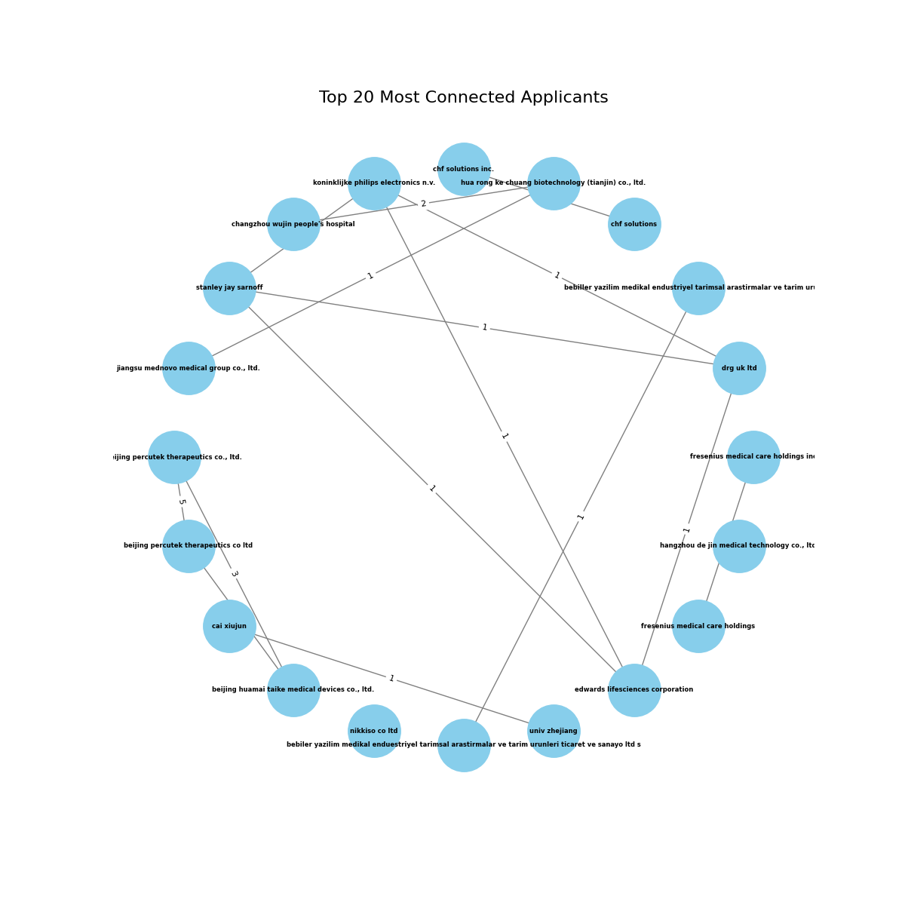

# Patent Analysis Platform

The web page has been published at [https://patent-analysis-e57ee02125bf.herokuapp.com/](https://patent-analysis-e57ee02125bf.herokuapp.com/).

  
  

    <h1 style="font-size: 2.2em; margin-bottom: 0.5em;">Welcome to the Patent Analysis Platform</h1>
    

      This web platform provides data analysis tools tailored for intellectual property professionals.
      You can generate insights and visualizations from international patent data in just a few steps.
    

  

## How to Use

1. Go to the [WIPO Patentscope](https://patentscope.wipo.int/search/en/search.jsf) search page.
2. Sign in to your WIPO account to enable downloading results.
3. Perform your patent search using any filters of interest (IPC codes, keywords, applicant, etc.).
4. Download the result list as an Excel file (XLS format).
5. Return here and upload the Excel file to generate custom visual analytics.

  <h3 style="font-size: 1.6em;">Watch this short tutorial:</h3>
  

    <iframe src="https://www.youtube.com/embed/eo31FWVMW_o?si=hmpVeIAeSrjxdBOC" frameborder="0" allow="accelerometer; autoplay; clipboard-write; encrypted-media; gyroscope; picture-in-picture" allowfullscreen style="position: absolute; top: 0; left: 0; width: 100%; height: 100%;"></iframe>
  

  This website is still under development, so for now, there is no need to log in to access advanced features.
  Please be patient with the generation time of the figures, currently, this web uses only basic cloud resources.
  The web page might become unresponsive if you load more than 3000 rows of data, so please narrow down your results.
  This problem can be solved by using more computing power, but that will depend on the interest arisen by this site.
  In future versions, signing up will allow users to save their searches and prevent the automatic deletion of generated graphics.

## Gallery of Sample Visualizations

Explore example graphics generated from international patent data.

### Countries Statistics

  

    
    
Priority patent filling, yearly frequency

  

  

    
    
Top Priority Filing Countries

  

  

    
    
Top 10 countries by publication

  

  

    
    
Patent priority vs destination countries

  

### Word Frequency Statistics: Wordclouds

  

    
    
Wordcloud (Nouns)

  

  

    
    
Wordcloud (Verbs)

  

  

    
    
Wordcloud (Adjectives)

  

### IPC and Applicants Statistics

  

    
    
Top 10 IPC groups

  

  

    
    
Technology evolution over time

  

  

    

      
      
Top 20 Applicants

    

    

      

        

          
          
Top 5 Applicants patent publication timeline

        

        
        
Most frequent IPC groups by Applicant

      

    

  

### Technology Transfer Landscape

  

    
    
Flow of Technological Know-How Through Shared Inventors

    
Applicants in the graph may have further connections out of this circle

  

 |

### Technology Transfer Landscape

| Visualization                       | Description                                                        |
| :---------------------------------- | :----------------------------------------------------------------- |
|  | Flow of Technological Know-How Through Shared Inventors Applicants in the graph may have further connections out of this circle |
